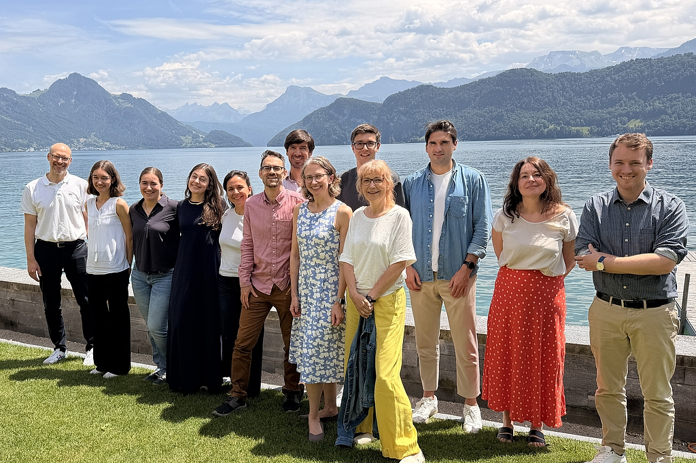

::: {.session-lead}
Why do some population groups experience systematically worse health than
others?

This course examines how health inequalities are measured and explained,
why they persist even in affluent countries such as Switzerland, and what public
policy can — and cannot — do about them.
:::


## Bainvgnieu![^bainvgnieu] Welcome!

:::::: columns
::: {.column width="28%"}
{width="300px"}
:::

::: {.column width="4%"}
:::

::: {.column width="68%"}
I'm David Weisstanner, Assistant Professor of Health and Social Policy
and co-director of the [**Center for Health, Policy and Economics
(CHPE)**](https://www.unilu.ch/en/faculties/faculty-of-health-sciences-and-medicine/research-and-centers/centers/center-for-health-policy-and-economics/overview/)
at the University of Lucerne.

I am interested in how health and social policies shape people's lives,
why inequalities arise and persist, and how citizens respond to policy
and social change.

[University profile](https://www.unilu.ch/david-weisstanner) · [Personal
website](https://www.davidweisstanner.com) ·
[LinkedIn](https://www.linkedin.com/in/david-weisstanner-98104668/) ·
[Email](mailto:david.weisstanner@unilu.ch)
:::
::::::

### About you

To help me get to know the group and your backgrounds and interests,
please complete this short questionnaire.

<iframe width="100%" height="700" src="https://forms.cloud.microsoft/Pages/ResponsePage.aspx?id=3ZnXZFMqJkeCWJS92OT-Ne3CbyYHOH1Mj2DV8648CzRUM0lJMFlHV0szMk1HN0ZCUldHOVZZQ1REQi4u&amp;embed=true" frameborder="0" style="border: none; max-width: 100%;">

</iframe>

### How this course will work

This course uses a **modular teaching format**. Sessions combine short
inputs, examples and evidence, individual or group work, and discussion.

The **course website is our common workspace**. It contains the core
material for each session and will often be used directly in class.
Slides will be used selectively where they add value.

For each session, a **print version of the website material** will also be
provided as a handout. You do not need to take notes on everything you see
on screen — the core material will remain available on the website and in
the handout.

## Health inequalities are well known

People's chances of living a long and healthy life differ substantially
— not only between countries, but also between population groups within
wealthy societies.

### International examples...

::: key-number
**20.7 years** The difference in life expectancy between the highest-
and lowest-life-expectancy groups in the "Eight Americas" study.
:::

The classic [**“Eight Americas”
study**](https://journals.plos.org/plosmedicine/article?id=10.1371/journal.pmed.0030260)
divided the US population into eight groups based on race, geography and
socioeconomic characteristics. In 2001, life expectancy differed by
**20.7 years** between the groups at the extremes.

![**Life expectancy in the “Eight Americas”.** Source: Murray et al.
[-@murrayEightAmericasInvestigating2006].](images/eight-americas-fig3.png){#fig-eight-americas
fig-align="center" width="80%"}

Large differences can also occur within cities. In **London**, life
expectancy varies substantially between neighbourhoods only a few
kilometres apart.

.](images/london.png){#fig-london
fig-align="center" width="75%"}

[**Explore the interactive map: Lives on the Line**](https://life.mappinglondon.co.uk/life/)


```{=html}
<!-- OPTIONAL EMBED:
<iframe
  src="https://life.mappinglondon.co.uk/life/"
  width="100%"
  height="600"
  style="border:0;"
  loading="lazy">
</iframe>
-->
```

**Glasgow** provides another well-known example of large spatial health
inequalities.

::: video-link
<a href="https://www.youtube.com/watch?v=KvwIW2dlUj8" target="_blank"> ▶
Watch: Danny Dorling on health inequality in Glasgow </a>
:::

```{=html}
<!-- SLIDE:
Keep international examples very short:
- Eight Americas: 20.7 years
- London: interactive map
- Glasgow: short Danny Dorling video
Then move to Switzerland.
-->
```

### ...and health inequalities in Switzerland

Switzerland has one of the highest average life expectancies in the
world and a well-resourced healthcare system. Yet health is not equally
distributed across the population.

The recent 2025 [**Obsan report on health inequalities in
Switzerland**](https://www.obsan.admin.ch/de/publikationen/2025-gesundheit-fuer-alle)
documents systematic differences by education, income, gender, migration
background and place of residence.

For example, in the 2022 Swiss Health Survey, **89% of people with
tertiary education** reported good or very good health, compared with
**69% among people with compulsory education**.

![**Education and self-rated health.** Source: FOPH [-@fophGesundheitFurAlle2025, p. 3],
based on Burla
[-@burlaGesundheitFuerAlle2025].](images/obsan2025_education_selfratedhealth.png){#fig-education-health
fig-align="center" width="70%"}

Differences are also found for more objective outcomes. The recent Obsan
findings show, for example, that men die twice as often from preventable
causes as women, and individuals with lower education face an **81%
higher risk of premature death** from conditions that could have been
prevented through healthcare or prevention [@burlaGesundheitFuerAlle2025].

![**Deaths** of 25- to 74-year-olds that could have been prevented
through screening or effective treatment. Source: FOPH [-@fophGesundheitFurAlle2025, p.
10], based on Burla
[-@burlaGesundheitFuerAlle2025].](images/foph2025_education_mortality.png){#fig-avoidable-mortality
fig-align="center" width="70%"}

### Income, illness and healthcare use

Similar differences also show up directly in the healthcare system. A
[**2026 analysis by the University of Basel for
Helsana**](https://www.helsana.ch/de/helsana-gruppe/medien-publikationen/helsana-reports/einkommensreport.html)
linked health-insurance data with official income data.

It found that people with lower household incomes:

- suffered more frequently from chronic diseases;
- used more medical services and had longer hospital stays;
- incurred higher healthcare costs; but
- made **less use of preventive services**.

For example, **depression was around three times as common** in the
lowest income category as in the highest. Chronic pain was also more
than three times as common [@felderHaushaltseinkommenInanspruchnahme2026].

At the same time, lower-income groups were less likely to participate in
colorectal-cancer screening — even where cantonal screening programmes
were free of charge [@felderHaushaltseinkommenInanspruchnahme2026].

```{=html}
<!-- SLIDE:
LOWER INCOME
   ↓
more chronic illness
more healthcare use
higher costs

BUT
   ↓
less use of prevention
-->
```

### A crisis can amplify existing inequalities

The COVID-19 pandemic made these differences particularly visible.

According to the [**Federal Office of Public
Health**](https://www.bag.admin.ch/de/gesundheitliche-chancengleichheit-und-covid-19),
socially disadvantaged groups in Switzerland were more likely to become
seriously ill with COVID-19.

People with only compulsory education had an **80% higher risk of
hospitalisation** than people with tertiary education. The BAG also
documents higher risks among migrant populations and people living in
disadvantaged neighbourhoods [@bagFaktenblattGesundheitlicheChancengleichheit2024].

### The geography of health inequality

Social disadvantage is not distributed randomly across Switzerland.

An interactive map based on the **Swiss Neighbourhood Index of
Socioeconomic Position** shows substantial socioeconomic differences
within cities and municipalities — sometimes across only a road, railway
line or neighbourhood boundary.

[**Explore the interactive map of socioeconomic differences in
Switzerland**](https://www.tagesanzeiger.ch/armut-und-reichtum-in-der-schweiz-diese-karte-zeigt-wo-die-privilegierten-wohnen-898746224551)

```{=html}
<!-- IMAGE:
A screenshot of the Zurich, Bern or Basel map would work very well here.
Prefer one city and keep the interactive link underneath.
-->
```

### Why does this matter for Swiss healthcare?

- **Different needs:** some population groups experience substantially
  more illness and therefore require more healthcare.
- **Different patterns of access and use:** treatment and prevention are
  not used equally across groups.
- **Planning and organisation:** knowing where needs and barriers are
  concentrated matters for prevention, service delivery and resource
  allocation.

## Taking a step back: What is health inequality?

The examples above describe **systematic differences in health between
population groups**. Definitions in the literature vary somewhat, including
in whether they incorporate ideas such as avoidability and unfairness
[@mccartneyDefiningHealthHealth2019;
@bravemanHealthInequalitiesDisparities2025].

For this course, we use **health inequality** first as a descriptive concept:

::: {.definition}
**Health inequality** refers to systematic differences in health outcomes
between individuals or social groups.
:::

Examples include differences in:

- life expectancy and mortality;
- disease and disability; and
- self-rated health and wellbeing.

Importantly, **health inequality is initially a descriptive concept**.
Observing a difference does not by itself tell us whether it is unfair,
avoidable, or caused by social disadvantage.

### (In)equality and (in)equity

These concepts are related, but they are not the same, and terminology is not
used completely consistently across disciplines and countries
[@bravemanHealthInequalitiesDisparities2025;
@bergenWritingHealthInequality2025].

In this course, we use the terms as follows:

- **(In)equality** describes observed differences, e.g. (un)equal
  treatment, resources or outcomes.
- **(In)equity** introduces a **normative judgement** about what would
  constitute a **fair** distribution.

Health equity therefore goes beyond documenting inequality: it asks
whether differences are **unfair or unjust**, and whether different
groups may require different resources or support.

![**Equality and equity.** Equal treatment does not necessarily produce
equal opportunities or outcomes. Source: Burla [-@burlaGesundheitFuerAlle2025, p.
7].](images/equality-equity.png){#fig-equality-equity fig-align="center"
width="50%"}

::: {.definition}
**This course focuses primarily on health inequality.** We first ask
who is healthier, how large the differences are, and what explains
them. Whether a particular inequality is unfair is an additional
normative question.
:::

```{=html}
<!-- DISCUSS:
Does every health inequality constitute an inequity?
Think of age, genetic differences, behaviour, access to care.
-->
```

This distinction also affects how we communicate empirical evidence.
Throughout the course, we will therefore try to state explicitly **which
health outcome, which population groups and which type of difference** we are
describing [@bergenWritingHealthInequality2025].

Session 2 turns this principle into an empirical question: **how can we
measure a health inequality?**

## A roadmap for this course

The conceptual model below provides a useful framework for organising
the different topics covered throughout the semester.

It distinguishes between the broader **context**, people's **social
position**, the **intermediary factors** through which social conditions
may affect health, and the resulting **distribution of health**.

The model does not by itself explain why health inequalities arise.
Instead, it helps structure the questions we will examine throughout the
course and motivates the selection of topics in the syllabus.

![**Conceptual model of health inequality.** Source: taken from Burla
[-@burlaGesundheitFuerAlle2025, p.
8].](images/obsan2025_conceptual-model.png){#fig-conceptual-model
fig-align="center" width="80%"}

### Reading the model

**Context**\
Economic, political, legal and cultural conditions — including social,
education and health policy — shape the distribution of resources and
opportunities.

**Social position**\
People occupy different positions in society. Important **vertical
dimensions** include education, income, wealth and occupational
position. Relevant **horizontal dimensions** include gender, migration
background, age, sexual orientation and place of residence.

**Intermediary factors**\
Social position affects exposure to resources and risks, including:

- material living and working conditions;
- psychosocial factors such as stress and social support;
- health-related behaviour; and
- access to, quality of and use of healthcare.

**Health outcomes**\
These processes can result in systematic differences in mortality,
morbidity, quality of life and wellbeing.

> **This model provides a roadmap for the course:** over the semester,
> we will examine how context and social position are related to health,
> which mechanisms may connect them, where healthcare enters the
> picture, and what role public policy may play.

## Session overview

The course follows the same broad logic as the conceptual model. Over
the semester, we move from **describing and measuring health
inequalities** to examining their **distribution, explanations and
policy implications**.

We will cover:

- **Measurement and comparison** — how large are health inequalities,
  and how do they vary across countries and over time?
- **Perceptions and explanations** — how do people understand health
  inequalities, and which mechanisms may explain them?
- **Dimensions of inequality** — socioeconomic position, gender,
  migration and ethnicity, intersectionality, the life course, and
  place.
- **Healthcare** — how do access, affordability and healthcare use
  relate to health inequalities?
- **Public policy** — which policies and institutions may reduce,
  reproduce or otherwise affect health inequalities?

[**See the full course syllabus**](../../syllabus.qmd)

## The empirical project

Alongside the substantive topics, you will develop your own **empirical
analysis of health inequality** using international survey data.

The aim is to move from reading about health inequalities to analysing
them yourself:

> **Research question → concepts → variables → comparison → analysis →
> interpretation → conclusion**

### The data

We will work primarily with two major cross-national survey programmes:

- the **European Social Survey (ESS)**; and
- the **International Social Survey Programme (ISSP)**.

Both provide individual-level survey data that allow us to examine
health outcomes alongside socioeconomic and demographic characteristics,
countries, time periods, healthcare experiences and attitudes.

### How the project develops

The empirical work is integrated throughout the semester. At the
beginning, you will work with guided exercises and predefined variables.
As the course progresses, you will make increasingly independent choices
about your research question, measures, comparisons and analysis.

The final paper brings these elements together in a small independent
empirical study of health inequality.

### The next two sessions: guided self-study

Sessions 2 and 3 are **guided self-study sessions**. There is no regular
classroom meeting.

The course website provides the explanations, step-by-step instructions
and ESS/ISSP exercises. Work through each session in the order
presented.

- **Session 2:** measuring health inequality and becoming familiar with
  the data
- **Session 3:** comparing health inequalities across countries and over
  time

If anything is unclear, or you encounter problems with the data or code,
please [**get in touch by email**](mailto:david.weisstanner@unilu.ch).


## About this page

This course material was developed with the support of generative AI
(ChatGPT, GPT-5.6 Sol, OpenAI), including assistance with drafting,
editing and coding. The content and its use in teaching remain the
responsibility of the instructor.

For guidance on the responsible use of generative AI in teaching and
research, see the Faculty of Health Sciences and Medicine's
[**position paper on artificial intelligence**](https://www.unilu.ch/studium/lehrveranstaltungen-pruefungen-reglemente/gmf/reglemente/).

[^bainvgnieu]: *Bainvgnieu* means “welcome” in **Puter**, the Romansh idiom spoken in the Upper Engadine. See the [Dicziunari Puter of the Uniun dals Grischs](https://www.udg.ch/dicziunari).