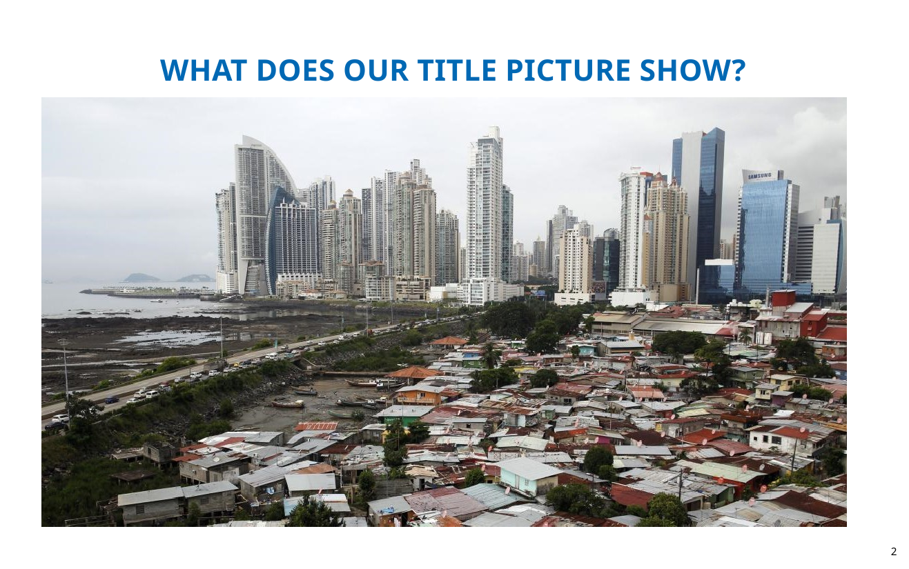
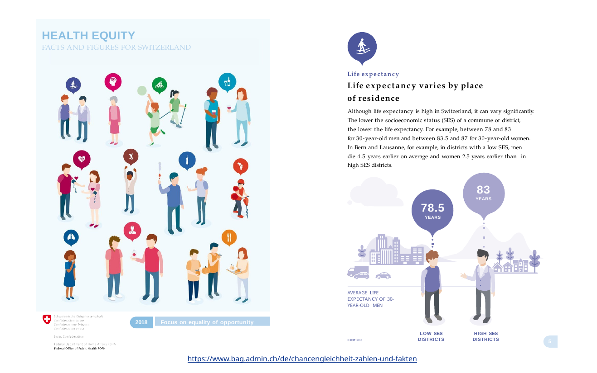
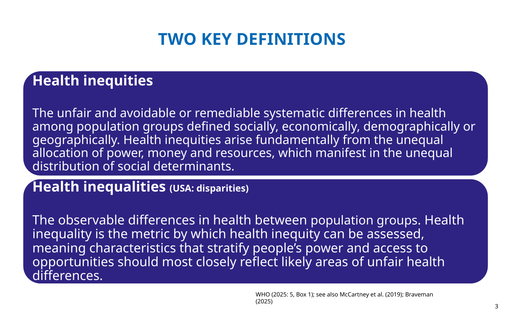

## What does our title picture show?

{fig-alt="Boca la Caja in front of Panama City's business district"}

::: notes
Where is it? What forms of inequality are visible? What could this have to do with health?
:::

## What does inequality have to do with health?

- Social differences structure exposure to risks and access to resources.
- Health outcomes are therefore not distributed randomly across populations.
- The course asks how to **describe**, **explain**, and **evaluate** these differences.

## Also in Switzerland?

## Two key concepts

## Health inequality

**Observable differences in health between population groups.**

Primarily a descriptive concept.

## Health inequity

**Unfair and avoidable or remediable systematic differences in health.**

Adds an explicitly normative judgement.

## Gap or gradient?

**Gap**

- compares two groups
- e.g. low vs high education

**Gradient**

- traces health across an ordered social hierarchy
- asks whether health improves step by step with socioeconomic position

## Why does the distinction matter?

1. We first need to **observe and measure** inequality.
2. We then ask **why** it exists.
3. Finally, we evaluate **whether and how policy should respond**.

## Applied part

Formulate one possible empirical question using ESS or ISSP:

- health outcome
- social dimension
- comparison or gradient

**Example:** How does self-rated health differ by educational attainment in Switzerland?

## Next week

**How can we measure health inequality?**

- absolute vs relative measures
- gaps vs gradients
- first ESS/ISSP indicators
