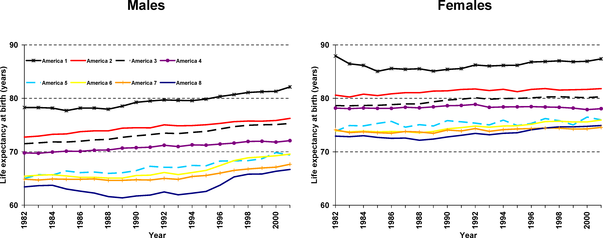
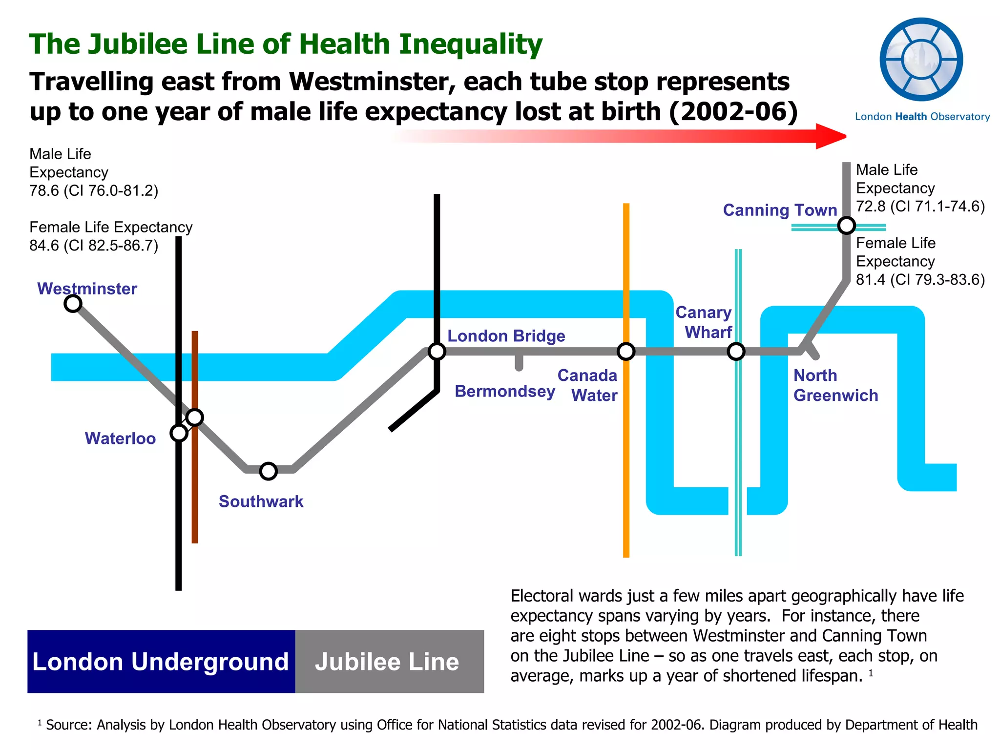
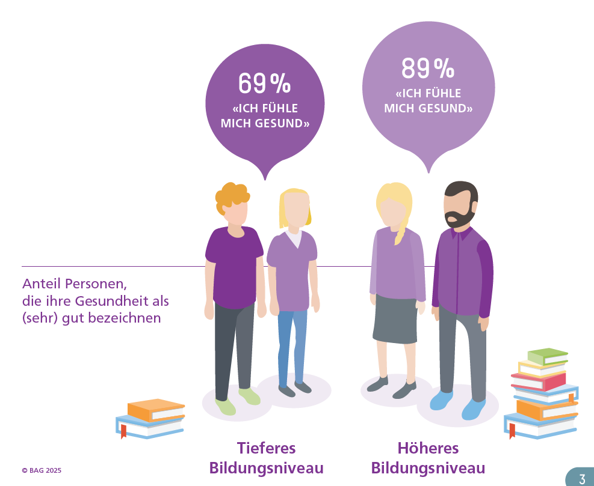
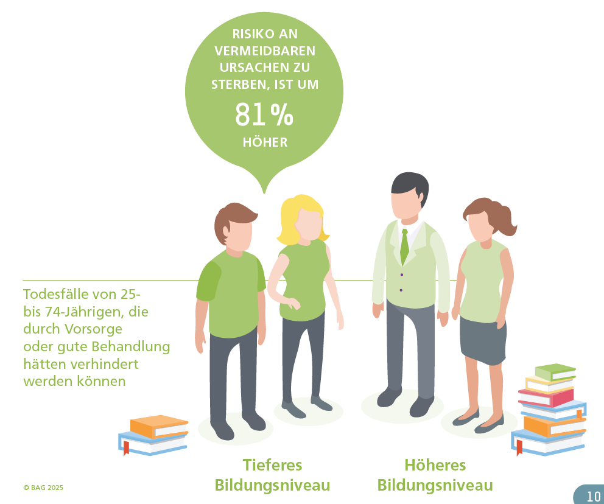
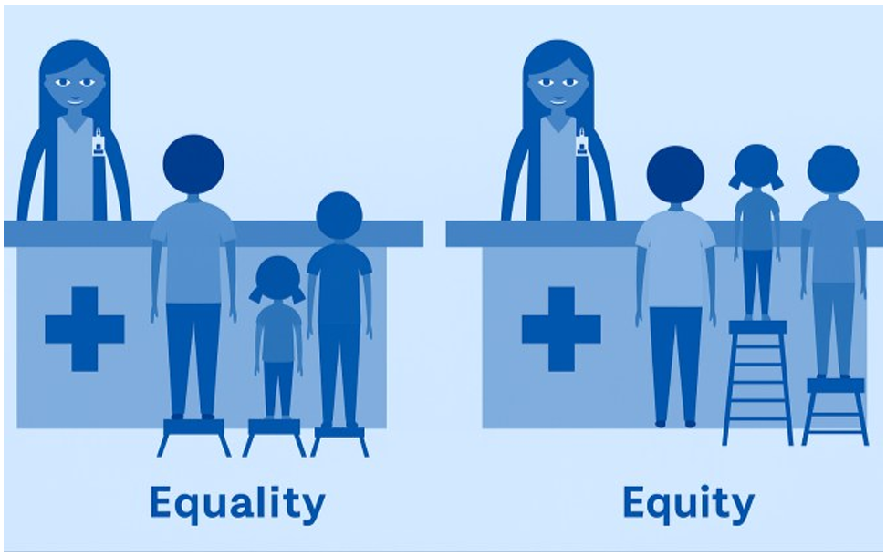
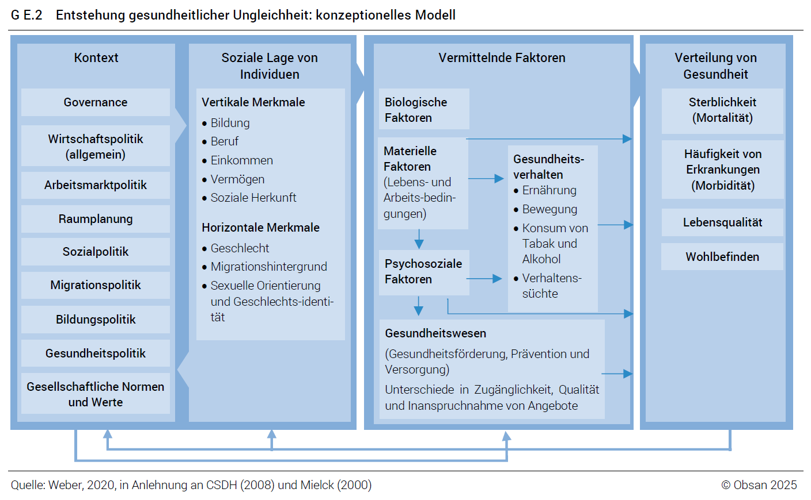

# Bainvgnieu! Welcome!

## About me

::::: columns
::: {.column width="34%"}
{width="100%"}
:::

::: {.column width="61%"}
### David Weisstanner

Assistant Professor of **Health and Social Policy**

Co-Director, **Center for Health, Policy and Economics (CHPE)**

My research is about:

- health and social policy
- inequality
- public opinion and political behaviour
:::
:::::

## About you

Please take **2–3 minutes** to complete the short questionnaire on the
course website.

We are interested in:

- your disciplinary background
- previous work experience
- experience with R, Stata or other software
- topics and questions you are interested in

```{=html}
<!-- DEMO:
Open the questionnaire from the course website.
Briefly discuss the aggregate responses afterwards.
-->
```

## How this course will work

This course uses a **modular teaching format**.

::::: columns
::: {.column width="48%"}
### In class

- short inputs
- examples and evidence
- individual or group work
- discussion
:::

::: {.column width="48%"}
### Between and during sessions

- course website
- empirical exercises
- ESS and ISSP data
- print version as handout
:::
:::::

. . .

> **The course website is our common workspace.**

Slides are used selectively where they add value.

## A question to start

> Why do some population groups experience systematically worse health
> than others?

. . .

This course examines:

**measurement · explanation · comparison · public policy**

# Seeing health inequality

## How large can health differences be?

::: key-number
**20.7 years**
:::

Difference in life expectancy between the groups at the extremes of the
**“Eight Americas”** study.

{width="65%"}

::: source
Source: Murray et al. [-@murray2006]
:::

```{=html}
<!-- SPEAKER:
Keep this short. The point is not the detailed construction of the Eight
Americas, but the magnitude of within-country health differences.
-->
```

## A few kilometres can matter

### London

{fig-align="center" width="100%"}

```{=html}
<!-- DEMO:
Open:
https://life.mappinglondon.co.uk/life/

Use the interactive map rather than explaining it extensively on the slide.
Important: do not imply that moving along the Underground causes the decline.
These are neighbourhood population differences.
-->
```

## What about Switzerland?

Switzerland has very high average life expectancy and a well-resourced
healthcare system.

. . .

But health is **not equally distributed** across the population.

## Education and health in Switzerland

::::::: columns
::::: {.column width="31%"}
::: key-number
**89%**
:::

Tertiary education

::: key-number
**69%**
:::

Compulsory education
:::::

::: {.column width="64%"}
{width="100%"}
:::
:::::::

::: source
Good or very good self-rated health, Swiss Health Survey 2022.\
Source: FOPH [-@foph2025], based on Burla [-@burla2025]
:::

## Not just self-rated health

{width="68%"}

Lower education is also associated with substantially higher risks of
**premature avoidable mortality**.

::: source
Source: FOPH [-@foph2025], based on Burla [-@burla2025]
:::

## Income, illness and healthcare use

::::: columns
::: {.column width="47%"}
### Lower household income

**More**

- chronic illness
- healthcare use
- hospital stays
- healthcare costs
:::

::: {.column width="47%"}
### But...

**Less**

- use of preventive services

. . .

Depression and chronic pain were substantially more common in the lowest
income groups.
:::
:::::

::: source
Source: Felder, Meyer & Schmidheiny [-@felder2026]
:::

```{=html}
<!-- SPEAKER:
Useful Swiss healthcare example because it complicates a simple
"disadvantaged people use less healthcare" story:
greater needs and greater overall use, but less prevention.
-->
```

## A crisis can amplify inequalities

::: key-number
**+80%**
:::

Risk of COVID-19 hospitalisation among people with **compulsory
education** compared with people with tertiary education in Switzerland.

. . .

Higher risks were also documented among migrant populations and people
living in disadvantaged neighbourhoods.

::: source
Source: FOPH [-@bag2024]
:::

## Health inequality also has a geography

Social disadvantage is not distributed randomly across Switzerland.

It varies across:

**cantons · municipalities · neighbourhoods**

. . .

Sometimes substantial socioeconomic differences occur across only a
**road, railway line or neighbourhood boundary**.

```{=html}
<!-- DEMO:
Open the interactive Swiss neighbourhood socioeconomic-position map:
https://www.tagesanzeiger.ch/armut-und-reichtum-in-der-schweiz-diese-karte-zeigt-wo-die-privilegierten-wohnen-898746224551
-->
```

## What do these examples have in common?

```{=html}
<!-- DISCUSS:
Ask students first. Collect a few answers before revealing.
-->
```

. . .

They describe systematic differences between **population groups**.

. . .

But they differ in:

- **what** health outcome is measured
- **which** groups are compared
- **where** the comparison is made
- the possible **reasons** for the difference

# What is health inequality?

## A working definition

::: definition
**Health inequality** refers to systematic differences in health
outcomes between individuals or social groups.
:::

. . .

These can concern:

**mortality · disease · disability · self-rated health · wellbeing ·
healthcare**

## Description comes first

> **Health inequality is initially a descriptive concept.**

Observing a difference does **not** by itself tell us whether it is:

. . .

**unfair**

. . .

**avoidable**

. . .

or **caused by social disadvantage**.

These are additional questions.

## Inequality ≠ inequity

::::: columns
::: {.column width="47%"}
### (In)equality

Describes observed differences in:

- treatment
- resources
- outcomes

**Descriptive question**
:::

::: {.column width="47%"}
### (In)equity

Introduces a judgement about what constitutes a:

- fair
- just

distribution.

**Normative question**
:::
:::::

## Equality or equity?

{width="48%"}

::: source
Source: Burla [-@burla2025]
:::

. . .

> Equal treatment does not necessarily produce equal opportunities or
> outcomes.

## Does every health inequality constitute an inequity?

```{=html}
<!-- DISCUSS:
3–4 minutes in small groups.

Do not aim for a yes/no answer. The point is to identify what additional
information or assumptions are needed to move from description to normative
evaluation.
-->
```

Think about health differences associated with:

::::::: columns
::: {.column width="24%"}
### Age
:::

::: {.column width="24%"}
### Genetics
:::

::: {.column width="24%"}
### Behaviour
:::

::: {.column width="24%"}
### Access to care
:::
:::::::

> **What would you need to know before judging a difference unfair?**

## Four different questions

An observed health difference can lead to four distinct questions:

. . .

### 1. Description

**Does a health difference exist?**

. . .

### 2. Explanation

**Why does it exist?**

. . .

### 3. Evaluation

**Is it unfair?**

. . .

### 4. Policy

**What, if anything, should public policy do?**

```{=html}
<!-- SPEAKER:
This distinction is important for the entire course.
Do not collapse empirical description, causal explanation, normative
evaluation and policy judgement.
-->
```

# A roadmap for the course

## How can health inequalities arise?

{width="78%"}

::: source
Conceptual model of health inequality. Source: Burla [-@burla2025]
:::

```{=html}
<!-- SPEAKER:
Important qualification: the model organises possible relationships; it does
not itself establish that any particular mechanism is causal.
-->
```

## Reading the model

::::::: columns
::: {.column width="23%"}
### Context

Economic\
Political\
Legal\
Cultural
:::

::: {.column width="23%"}
### Social position

Education\
Income\
Occupation\
Gender\
Migration\
Place
:::

::: {.column width="23%"}
### Intermediary factors

Material\
Psychosocial\
Behaviour\
Healthcare
:::

::: {.column width="23%"}
### Health

Mortality\
Morbidity\
Quality of life\
Wellbeing
:::
:::::::

## The questions we will ask

### Measure and compare

How large are health inequalities — and how do they vary?

. . .

### Explain

Which mechanisms may connect social position and health?

. . .

### Differentiate

Which dimensions of inequality matter?

. . .

### Healthcare

Where do access, affordability and use enter?

. . .

### Public policy

How do policies and institutions shape these relationships?

# Your empirical project

## From reading to doing

Alongside the substantive topics, you will develop your own empirical
analysis of health inequality.

> **Research question → concepts → variables → comparison → analysis →
> interpretation → conclusion**

## The data

::::: columns
::: {.column width="47%"}
### ESS

**European Social Survey**

Cross-national individual-level survey data
:::

::: {.column width="47%"}
### ISSP

**International Social Survey Programme**

Cross-national individual-level survey data
:::
:::::

. . .

Both allow us to examine:

> **health × social position × demographic characteristics × countries ×
> time**

## How the project develops

:::::: columns
::: {.column width="30%"}
### Start

Guided exercises

Predefined variables

Step-by-step analysis
:::

::: {.column width="30%"}
### Develop

Choose measures

Choose comparisons

Develop your question
:::

::: {.column width="30%"}
### Finish

Independent analysis

Interpretation

Empirical paper
:::
::::::

## The next two sessions

::::: columns
::: {.column width="47%"}
### Session 2

**How can we measure health inequality?**

24 September · Self-study

- health outcomes
- dimensions of inequality
- absolute and relative measures
- Switzerland
:::

::: {.column width="47%"}
### Session 3

**Health inequality across countries**

1 October · Self-study

- cross-national comparison
- change over time
- ESS and ISSP
- comparability
:::
:::::

The website provides the explanations, instructions and exercises.

# Take away

## Three questions to keep asking

### 1. Who?

**Who has better or worse health?**

. . .

### 2. How much?

**How large is the difference?**

. . .

### 3. Why — and what follows?

**What would we need to know before explaining, evaluating or responding
to the difference?**

. . .

> **Observe → measure → explain → evaluate**

## References

::: {#refs}
:::
